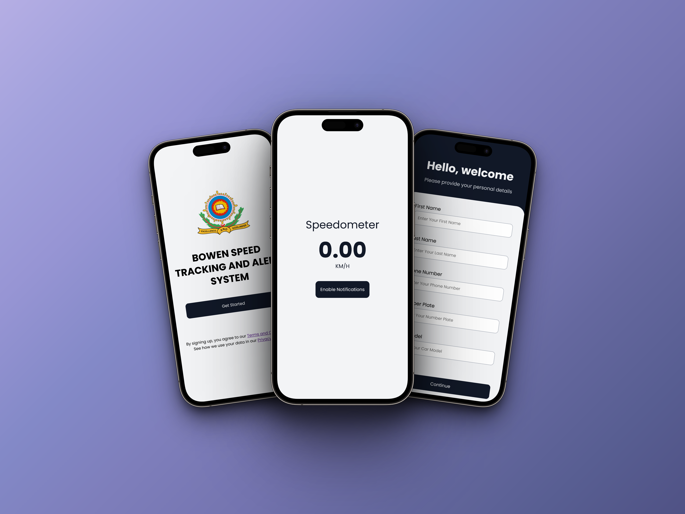

# **BSTAS** Web App Documentation

## Overview

This is a multipage web app built using **HTML, CSS, JavaScript, APIs,** and various **third-party libraries and frameworks**. The app consists of ***a welcome page, a form page for users to input their details, and a speedometer page with the speedometer component.***




## Pages

### Welcome Page

The welcome page displays the logo, the name of the web app, and a "Get Started" button. Clicking the button navigates the user to the form page using the window location function in JavaScript.<br><br>

### Form Page

The form page contains five form fields where users can input their ***first name, last name, phone number, car model, and number plate.*** It also includes a "Continue" button to store the user's details.


If all form fields are filled, clicking the "Continue" button stores the user's data in the browser's memory using **local storage** in a JSON format. An alert is displayed to confirm the successful storage, and the page navigates to the speedometer component page.

If any form fields are left unfilled, an alert message is displayed, prompting the user to fill all fields before proceeding to the speedometer component page.<br><br>

### Speedometer Page

The speedometer component is located on this page, along with an "Enable Notification" button below it. When the page is loaded, it requests location access using the **Geolocation API**.

```
function requestNotificationPermission() {
  if ("Notification" in window) {
    Notification.requestPermission()
      .then((permission) => {
        if (permission === "granted") {
          new Notification("Notification Enabled", {
            body: "You will now receive notifications when exceeding the speed limit.",
            icon: "notification-icon.png",
          });
        }
      })
      .catch((error) => {
        console.error("Error requesting notification permission:", error);
      });
  }
}
```

Users can click the "Enable Notification" button, implemented with the **Notifications API**, to receive overspeed notifications.<br><br>

#### Speedometer Component

The speedometer component utilizes the **Geolocation API** provided by the **W3C**. This API allows for one-time and real-time geographical calculations. The ***watchPosition*** function is implemented to obtain real-time data, and the ***speed*** object is used to retrieve the current speed.

``` 
navigator.geolocation.watchPosition(successCallback);

function successCallback(position) {
  const speedInMetersPerSecond = position.coords.speed;
}
```

The speed is converted from ***meters per second (m/s)*** to ***kilometers per hour (km/h)*** by multiplying it by **3.6**. It is then rounded to two decimal places for readability.
An ***if-else*** statement is used to determine if the user is not stationary. If the user is not stationary, the speed value is displayed on the client-side using **DOM manipulation**. Otherwise, "N/A" is displayed.

Within the if-else statement, another ***if-else*** statement checks if the speed is above **30 km/h.** If it is, the following actions occur:

- A warning toast is displayed to alert the driver.
- A pop-up alert is displayed to caution the driver.
- A push notification, enabled by clicking the "Enable Notification" button earlier, is sent to the driver's device as a warning.
- Additionally, a function is invoked to retrieve the driver's details from the JSON file stored in the local storage, which were provided when the form was filled. The data, along with a timestamp indicating the date and time of the overspeeding incident (obtained using the new Date object and converted to ISO format), is pushed to a real-time Firebase database.

```
  const storedDetails = localStorage.getItem("details");

      // Check if the stored details exist and are not empty
      if (storedDetails) {
        const details = JSON.parse(storedDetails);

        // Push the details to Firebase Realtime Database
        overspeedingReportDB.push(details, (error) => {
          if (error) {
            console.error("Error pushing data to Firebase:", error);
          } else {
            console.log("Data pushed to Firebase successfully.");
          }
        });
      }
```

If the speed is **below 30 km/h**, none of the above actions occur.<br><br>

## Tools Used

- VS Code: Integrated development environment used for coding and editing the web app.
- Git Bash: Command-line interface used for version control and interacting with Git repositories.
- GitHub: Hosting platform used for storing and sharing the source code and project files.
- Node.js: JavaScript runtime environment used for server-side scripting and running JavaScript applications.
- Stack Overflow: Online community and resource used for troubleshooting and finding solutions to programming questions and issues.

## Language and Libraries

- HTML: Markup language used for structuring the web pages.
- CSS: Styling language used for designing the appearance and layout of the web pages.
- JavaScript: Programming language used for adding interactivity and functionality to the web app.
- API: Application Programming Interface used for integrating external services and functionalities into the web app.
- Firebase: Real-time database and backend service used for storing and retrieving user data and providing real-time updates.<br><br>

***Please note that the specific versions and configurations of these tools and libraries may vary based on the project requirements and developer preferences.***